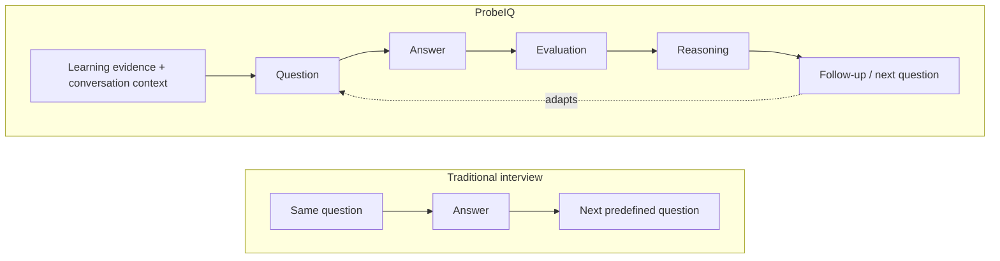
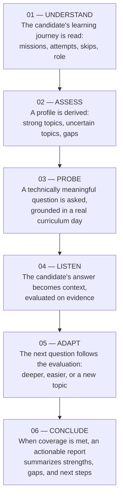
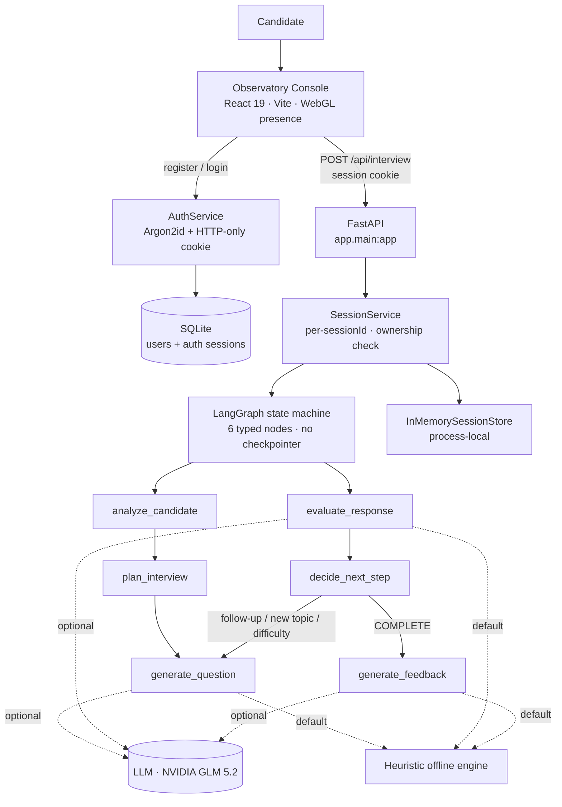
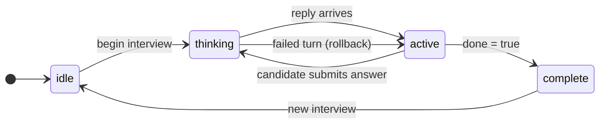
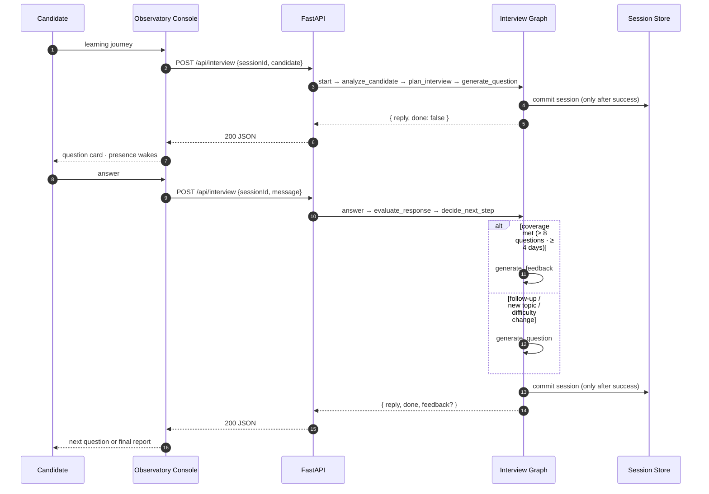

<div align="center">

# ⚡ ProbeIQ

### The AI interview agent that thinks, adapts, and interviews.


**A candidate's 31-day learning journey becomes a live, adaptive technical interview — every next question decided by the answer before it.**

[Why ProbeIQ](#the-problem) · [The interview experience](#the-interview-experience) · [Under the hood](#under-the-hood) · [API](#api) · [Quick start](#quick-start) · [Testing](#testing--quality)

</div>

---

## Contents

- [The problem](#the-problem)
- [The interview experience](#the-interview-experience)
- [Features](#features)
- [Under the hood](#under-the-hood)
- [The living console](#the-living-console)
- [Tech stack](#tech-stack)
- [Built with an AI-native workflow](#built-with-an-ai-native-workflow)
- [API](#api)
- [How a turn travels](#how-a-turn-travels)
- [The journey](#the-journey)
- [Quick start](#quick-start)
- [Configuration](#configuration)
- [Testing & quality](#testing--quality)
- [Security](#security)
- [Project status](#project-status)
- [Roadmap](#roadmap)
- [Contributing](#contributing)
- [License](#license)

---

## The problem

A 31-day AI cohort produces **no two identical candidates**. The fastest learner is never stretched, the shakiest topic is never probed, and the interviewer is left guessing what each person actually knows.

```
Candidate A → passed RAG first try, strong on embeddings, skipped MCP
Candidate B → passed MCP, struggled repeatedly with vector databases
Candidate C → completed the whole cohort but failed Multi-Agent Orchestration
```

A fixed questionnaire ignores all of it.



ProbeIQ replaces *"fixed questions + fixed rubric"* with a closed loop driven by the candidate's actual learning evidence. **It doesn't just hear an answer — it reasons about what to ask next.**

---

## The interview experience

An interview is a sequence. ProbeIQ walks through it deliberately — observe, assess, probe, listen, adapt, conclude.



Every step in that chain is implemented and verified. Run the same interview twice and you get the same trace — **the engine never rolls dice.**

---

## Features

### 🎯 Adaptive interviewing
The heart of the system. Each answer is mapped to a coarse quality (`weak` / `adequate` / `strong`), and a deterministic controller picks the next move: a **follow-up**, a **new topic**, an **increase or decrease in difficulty**, or **completion** — based on a probe focus derived from the evaluation. A weak answer drops a level; a strong one is pushed deeper — once. The safety rails are hard: `8` minimum questions, `4` minimum covered days, `16` question hard cap, `3` questions per topic.

### 🧩 Candidate personalization
Every interview is planned from a candidate profile: completed missions, attempt counts, skipped days, and job role. Evidence is interpreted as signals — a `passed` mission on the first try supports higher-depth questioning; a mission passed only after many attempts becomes a *diagnostic* probe target; a skip is never assumed mastered. Two candidates never get the same interview.

### 💬 Multi-turn context
Conversation state is a compact, typed structure — covered topics, questions asked, last answers, difficulty — **never a raw transcript dump**. One HTTP request maps to one graph invocation, so every turn is stateless from the server's perspective and safe to retry.

### 🔎 Technical assessment
Questions are grounded in a specific curriculum day's **objectives and tools** — not generic prompts. Answer evaluation returns a structured `score`, `assessment`, `strengths`, `missing_concepts`, `misconceptions`, `depth_level`, and a `recommended_probe`. Every claim in the final report traces back to a recorded evaluation.

### 📋 Structured feedback
The interview ends with an evidence-based report: `summary`, `strengths`, `gaps`, and `next`. Nothing is invented — each item is grounded in a recorded evaluation or the interview plan.

### 🛡️ Reliability
A failed turn **mutates nothing**: the session store is written only after a successful graph run, so the client can retry safely. The LLM's output is Pydantic-validated and cross-checked against the curriculum before it can influence a session.

---

## Under the hood



| Layer | Location | Role |
|---|---|---|
| API | `backend/app/api/routes/interview.py` | `POST /api/interview` — request/response shaping, ownership gate |
| Auth API | `backend/app/api/routes/auth.py` | register / login / logout / me + session cookie |
| Auth core | `backend/app/core/security.py`, `core/database.py` | Argon2id, token generation, SQLAlchemy/SQLite |
| Composition root | `backend/app/api/dependencies.py` | Service + LLM wiring, `get_current_user` gate |
| Services | `backend/app/services/` | Deterministic analysis, planning, strategy, auth |
| Orchestration | `backend/app/orchestration/` | LangGraph nodes + decision rules |
| Agents | `backend/app/agents/` | Question / evaluation / feedback generators |
| LLM factory | `backend/app/llm/factory.py` | `ChatNVIDIA` / `ChatOpenAI` construction |
| Session store | `backend/app/repositories/session_store.py` | Process-local interview state |
| Frontend | `frontend/src/` | The Observatory console (see below) |

**Two engines, one controller.** With no API key configured, ProbeIQ runs **fully offline** on deterministic question templates, heuristic evaluation, and rule-based feedback. When `PROBEIQ_LLM_ENABLED=true`, an LLM (NVIDIA GLM 5.2 by default) elevates the phrasing and the judgment — while the deterministic controller keeps deciding **what to ask next**. That separation is the core design: the *decisions* stay inspectable even when the *wording* is generative.

---

## The living console

The frontend ("**The Observatory 3D**", locked spec in `frontend/DESIGN.md`) is built around a **living interviewer presence** — a lazy-loaded WebGL particle core that reacts to interview state.

**The interview itself is a state machine:**



**The presence is derived from that state** — it is a *visual instrument*, not a reasoning engine:

| Interview status | Presence state | What the core does |
|---|---|---|
| `idle` | `IDLE` | slow drift, soft breathing |
| `thinking` | `THINKING` | contracts and brightens, short damped spin-up |
| `active` (reply just arrived) | `RESPONDING` | brief burst, then eases to neutral |
| `active` (awaiting input) | `WAITING` | near-still — ambient movement gated ~0.3× |
| `complete` | `COMPLETE` | quiets and recedes; render loop pauses |

```text
candidate answer  →  interview state  →  presence state  →  visual response
```

On "Begin interview" the core **recedes** so the 2D console becomes the focus; questions push in from depth (`z: -80`, `rotateX: -3`) through two centralized springs (`snappy`, `ui` in `src/lib/motion.ts`). The scene is lazy-loaded (never the LCP element), paused off-screen, dpr-capped — and `prefers-reduced-motion` flattens every 3D move to a 2D fade. No-WebGL and low-power devices get a static poster. Typography is Outfit (UI) + JetBrains Mono (the interviewer's voice).

---

## Tech stack

### Frontend
React 19 · TypeScript · Vite 8 · Tailwind CSS v4 · Framer Motion · zustand · axios · react-router-dom · zod · three.js · @react-three/fiber · @react-three/drei

### Backend
Python 3.13 · FastAPI · Pydantic v2 · pydantic-settings · LangGraph · LangChain (`ChatNVIDIA`, `ChatOpenAI`) · SQLAlchemy 2.x + SQLite · argon2-cffi · email-validator · httpx · uvicorn

### Testing & quality
Playwright (e2e) · pytest · ruff · mypy · ESLint · TypeScript `tsc -b`

### Data
`curriculum.json` — 31 days / 8 modules of objectives + tools · `candidates.json` — 20 sample learning profiles · SQLite — auth persistence

---

## Built with an AI-native workflow

ProbeIQ is built with an AI-coding workflow whose guardrails are part of the repository — not a list of tools, but the reason each one exists:

| Tool / skill | Why it's here |
|---|---|
| **OpenCode** | The coding agent. Reads the project rules before touching anything; inspects → plans → implements → tests → shows the diff → commits only when asked |
| **`ui-ux-pro-max`** | UI/UX design intelligence — typography, color, layout, motion direction |
| **`impeccable`** | UX critique, audit, polish, and motion guidance for the interface |
| **Project instruction files** | `.opencode/PROJECT.md`, `AGENT.md`, `BACKEND.md`, `FRONTEND.md`, `RULES.md`, `GIT.md` — anti-hallucination rules, no invented features, safe Git practices |
| **uv** | Locked, reproducible backend dependency management |
| **Docker / Compose** | Containerized backend, single service on port 8000 |

The guardrails are what keep every claim in this README verifiable.

---

## API

The contract is defined in `.opencode/technical-spec.md`. Interview sessions require an account — a deliberate, user-approved extension to the base spec.

### Auth

| Method | Path | Purpose |
|---|---|---|
| `POST` | `/api/auth/register` | Create an account (201), sets the session cookie |
| `POST` | `/api/auth/login` | Verify credentials, sets the session cookie |
| `POST` | `/api/auth/logout` | Revoke the session server-side, clears the cookie |
| `GET` | `/api/auth/me` | `{ user: {id, email} \| null }` — always 200 |

Register and login accept `{ "email": "...", "password": "..." }` (password ≥ 8 chars on register) and return `{ "id": "...", "email": "..." }`. Authentication is an **HTTP-only session cookie** (`probeiq_session`, `SameSite=Lax`, `Secure` in production, 14-day TTL).

### `POST /api/interview`

Requires a valid session cookie. Every session is bound to the account that started it.

| Use | Request body |
|---|---|
| **Start a session** | `{ "sessionId": "...", "candidate": { ... } }` |
| **Send a turn** | `{ "sessionId": "...", "message": "..." }` |

Exactly one of `candidate` (start) or `message` (turn) must be present. Every response is `{ "reply": string, "done": bool, "feedback": null | {summary, strengths, gaps, next} }`.

**Start a session:**

```json
{
  "sessionId": "demo-2",
  "candidate": {
    "member": {
      "id": "CAND-001",
      "name": "Sarah Johnson",
      "jobRole": "Senior Data Engineer",
      "yearsExperience": 9,
      "education": "MS Computer Science",
      "status": "COMPLETED"
    },
    "missions": [
      { "day": 7, "title": "Embeddings Explained", "passed": true, "attempts": 1 },
      { "day": 22, "title": "Multi-Agent Orchestration", "passed": true, "attempts": 2 },
      { "day": 29, "title": "Monitoring, Logging & Observability", "skipped": true }
    ],
    "signals": { "commitDays": 28, "missionsCompleted": 30, "missionsFirstTry": 20 }
  }
}
```

```json
// 200 OK — the `[dev-template]` prefix marks the offline question generator
{
  "reply": "[dev-template] Walk through how you would implement 'Understand how text is converted into vector embeddings' for Embeddings Explained.",
  "done": false,
  "feedback": null
}
```

**Answer — and watch it adapt.** The follow-up is built from the evaluation's probe focus:

```json
{
  "sessionId": "demo-2",
  "message": "Embeddings map tokens into a vector space where semantically similar items are closer together, so retrieval can match by meaning rather than exact keywords."
}
```

```json
// 200 OK
{
  "reply": "[dev-template] Your previous answer was conceptually sound. Now design it for architecture: components, trade-offs, and failure handling for 'Understand how text is converted into vector embeddings'.",
  "done": false,
  "feedback": null
}
```

**Completion (8 turns):**

```json
{
  "reply": "Interview completed.",
  "done": true,
  "feedback": {
    "summary": "Interview complete: 8 questions across 4 curriculum days; 4/8 answers strong, 4 adequate, 0 weak.",
    "strengths": ["Demonstrated strong understanding of Multi-Agent Orchestration"],
    "gaps": [
      "Incomplete understanding of Embeddings Explained: Generate embeddings for every knowledge base chunk",
      "Incomplete understanding of Model Context Protocol (MCP): Build an MCP server exposing healthcare chatbot tools"
    ],
    "next": [
      "Review: Generate embeddings for every knowledge base chunk",
      "Review: Store embeddings alongside the original documents"
    ]
  }
}
```

Feedback arrays are capped at 3 items each; every statement traces back to a recorded evaluation or the interview plan.

**Errors** are always `{ "error": code, "detail": message }` — `400 invalid_request` / `session_completed`, `401 not_authenticated` / `invalid_credentials`, `403 forbidden` (cross-account session), `404 session_not_found` / `candidate_not_found` / `day_not_found`, `409 session_already_exists` / `account_already_exists`, `422 invalid_request` (schema), `500 interview_engine_error` / `data_load_error` / `llm_configuration_error` / `internal_error`. Stack traces and credentials never reach the client.

---

## How a turn travels



---

## The journey

```text
01  Create an account
02  Candidate context is loaded
03  The interview is planned
04  The first question appears
05  The candidate responds
06  The interviewer reasons about the answer
07  The follow-up adapts
08  The interview continues
09  Coverage is met · the interview concludes
10  A structured report appears
```

Every step is implemented, verified, and covered by an automated test suite.

---

## Quick start

### Prerequisites

- **Backend:** Python 3.13 + [uv](https://docs.astral.sh/uv/) (`backend/.python-version` = 3.13)
- **Frontend:** Node.js (npm) — Vite 8
- **Optional:** Docker / Compose; an NVIDIA (or OpenAI-compatible) API key for LLM-backed interviews

### Backend

```bash
cd backend
uv sync --locked            # install the locked environment
uv run uvicorn app.main:app --reload
```

The API is now at `http://localhost:8000` (`/docs` for interactive Swagger, `/openapi.json` for the schema). It runs **fully offline by default** — no key, no network, no LLM required.

### Frontend

```bash
cd frontend
npm install
npm run dev                 # http://localhost:5173, /api proxied to :8000
```

Open `http://localhost:5173`, create an account, and begin an interview. Protected screens redirect to `/login` until you're authenticated. The Vite proxy target is configurable: `PROBEIQ_API_TARGET=http://localhost:8000 npm run dev`.

### Docker

```bash
docker build -t probeiq-backend ./backend
docker compose up -d        # from the repo root, port 8000
docker compose down         # never `down -v`
```

### Verify

```bash
# backend/ — tests, lint, types
uv run pytest
uv run ruff check app tests
uv run mypy app tests

# frontend/ — build, lint, e2e (e2e starts its own backend on :8001 + Vite on :5174)
npm run build
npm run lint
npm run test:e2e
```

---

## Configuration

Backend settings come from `PROBEIQ_`-prefixed environment variables via pydantic-settings. Copy `backend/.env.example` → `backend/.env` for local overrides (git-ignored). **Never commit a real key.**

| Variable | Default | Purpose |
|---|---|---|
| `PROBEIQ_DATA_DIR` | `app/data` | `curriculum.json` / `candidates.json` / SQLite DB |
| `PROBEIQ_ENVIRONMENT` | `development` | `production` also sets the cookie `Secure` flag |
| `PROBEIQ_CORS_ALLOWED_ORIGINS` | `http://localhost:5173,http://127.0.0.1:5173` | Explicit browser origins (no wildcard; credentials enabled) |
| `PROBEIQ_DATABASE_URL` | *(empty)* | Auth persistence URL; defaults to `sqlite:///app/data/probeiq.db` |
| `PROBEIQ_AUTH_COOKIE_NAME` | `probeiq_session` | HTTP-only session cookie name |
| `PROBEIQ_AUTH_SESSION_TTL_DAYS` | `14` | Session token lifetime |
| `PROBEIQ_MIN_QUESTIONS` | `8` | Minimum questions before completion |
| `PROBEIQ_MIN_COVERED_DAYS` | `4` | Minimum distinct curriculum days covered |
| `PROBEIQ_MAX_QUESTIONS_PER_TOPIC` | `3` | Topic saturation cap |
| `PROBEIQ_HARD_MAX_QUESTIONS` | `16` | Hard completion safety valve |
| `PROBEIQ_LLM_ENABLED` | `false` | Enable LLM-backed phrasing / judgment |
| `PROBEIQ_LLM_PROVIDER` | `openai-compatible`¹ | `nvidia` \| `openai` \| `openai-compatible` |
| `PROBEIQ_LLM_MODEL` | *(unset)*¹ | Chat model id |
| `PROBEIQ_LLM_BASE_URL` | *(empty)* | NVIDIA default applied when empty |
| `PROBEIQ_LLM_API_KEY` | *(empty)* | **Your key — never commit** |
| `PROBEIQ_LLM_TEMPERATURE` | `0` | Sampling temperature |
| `PROBEIQ_LLM_TOP_P` | `1.0` | Sampling top-p |
| `PROBEIQ_LLM_MAX_TOKENS` | `16384` | Max completion tokens |
| `PROBEIQ_LLM_SEED` | `42` | Sampling seed |
| `PROBEIQ_LLM_MAX_RETRIES` | `2` | Bounded retry count |

**Frontend** (all optional): `PROBEIQ_API_TARGET` (dev proxy target, default `http://localhost:8000`), `PROBEIQ_E2E_API_PORT`, `PLAYWRIGHT_BASE_URL`, `PLAYWRIGHT_PREVIEW`.

> ¹ Code defaults. The shipped `backend/.env.example` overrides both to the NVIDIA path (`nvidia` / `z-ai/glm-5.2`) — the documented way to enable LLM-backed interviews.

---

## Testing & quality

Run and verified at the time of this README revision (Aug 2026) — they may drift as the codebase evolves.

| Check | Command (from `backend/` unless noted) | Result |
|---|---|---|
| Backend tests | `uv run pytest` | **180 passed, 3 skipped** (~5.5 s) — the 3 skips are opt-in live-LLM tests |
| Lint | `uv run ruff check app tests` | Clean |
| Types | `uv run mypy app tests` | Clean — 89 source files |
| Frontend build | `npm run build` | Clean |
| Frontend lint | `npm run lint` | Clean |
| Frontend e2e | `npm run test:e2e` | **51 passed, 4 skipped** — full interview loop, completion + report, error rollback/retry, accessibility, reduced motion, responsive overflow, WebGL fallbacks, auth + protected-route guards |

`backend/audit_verify.py` is a deterministic audit driver runnable independently of pytest; the Phase 15 report in `backend/AUDIT_REPORT.md` records **30 PASS / 2 WARN / 0 FAIL** across its checks.

---

## Security

- **Secrets:** the LLM API key is a `SecretStr` — never logged, never printed, never in error messages. `backend/.env` is git-ignored; `.env.example` ships placeholders only.
- **Passwords:** Argon2id hashing; login failures return one generic message so the API never reveals whether an email exists.
- **Sessions:** opaque, cryptographically random tokens stored server-side until logout or expiry, delivered as an HTTP-only `SameSite=Lax` cookie (`Secure` in production). Logout revokes the row immediately.
- **Ownership:** every interview session is bound to the authenticated user; cross-account access is rejected server-side (`403 forbidden`). Frontend route guards are UX only.
- **CORS:** explicit, environment-configured origins with credentials enabled — never a wildcard.
- **Docker:** `.dockerignore` keeps `.env` and caches out of the image; `docker-compose.yml` loads `backend/.env` as an *optional* `env_file`.

> ⚠️ **Never commit `backend/.env`.** If a key is ever printed to a terminal or a PR, rotate it immediately.

---

## Project status

**Implemented & verified**
- Deterministic adaptive interview engine — plan → question → evaluate → decide → feedback (LangGraph, 6 typed nodes)
- Offline template question generation + heuristic evaluation (the default — fully offline)
- Optional NVIDIA GLM 5.2 / OpenAI / OpenAI-compatible LLM path with grounded, validated structured output
- Accounts: register / login / logout / me, Argon2id, HTTP-only session cookies, SQLite persistence, interview ownership
- React "Observatory 3D" console — WebGL presence, adaptive state machine, reduced-motion + fallback support
- Docker + Compose backend; CORS with credentials; 180 backend tests, 51 e2e tests, ruff/mypy clean

**Partially verified**
- Live NVIDIA inference is **implemented but not verified from the authoring machine** (the gateway times out on valid requests at the network level; the offline path is the fully verified default). The failure path is graceful and safe — a failed LLM call never mutates session state.

**Planned**
- Live LLM end-to-end verification on a network-valid machine
- Observability: structured logging, per-node timing
- Auth hardening: rate limiting / brute-force protection
- Persisted, restart-safe interview sessions (Postgres path exists via SQLAlchemy)
- Frontend topic-transition choreography (awaits reliable topic metadata from the backend)

---

## Roadmap

Short and honest:

1. Verify the live LLM path end-to-end on a machine with working connectivity to the NVIDIA gateway.
2. Add structured logging and per-node timing (open audit finding).
3. Harden auth with rate limiting on login/register.
4. Persist interview sessions across restarts.
5. Capture demo media after the final UI pass.

---

## Contributing

This repository is built to be AI-assistable — the same rules apply to humans. `.opencode/GIT.md` is strict: no force-pushes, no history rewrites, targeted staging only.

1. **Fork** the repository and create a branch (`git checkout -b feat/your-change`).
2. **Change** the smallest relevant surface — read the surrounding code first.
3. **Verify** from `backend/`: `uv run pytest`, `uv run ruff check app tests`, `uv run mypy app tests`. Frontend: `npm run lint`, `npm run build`, and `npm run test:e2e` from `frontend/`.
4. **Never** stage secrets, `.env`, `node_modules/`, caches, or build artifacts. Prefer targeted `git add <path>`.
5. **Commit** with a clear message; **push** and open a pull request.

AI-generated contributions should follow `.opencode/AGENT.md`: inspect before modifying, never claim something works until it is verified, never invent functionality.

---

## License

No license file is present in this repository at this time.

---

<div align="center">

**ProbeIQ isn't trying to ask more questions.**

**It is trying to ask the *right next question*.**

A deterministic interview engine in front of an optional LLM — because the *decisions* should stay inspectable even when the *wording* is generative.

</div>
