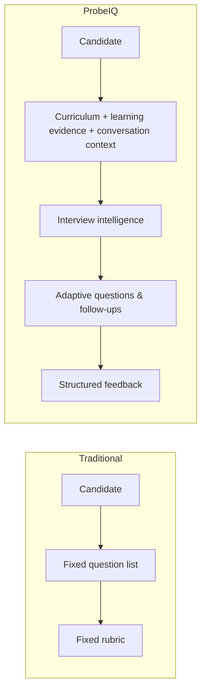
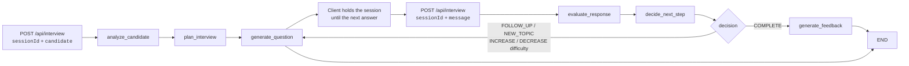
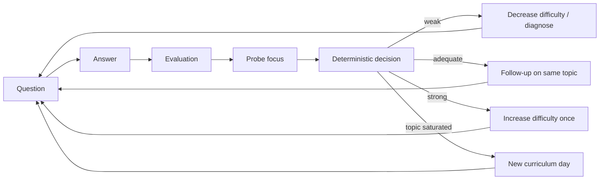
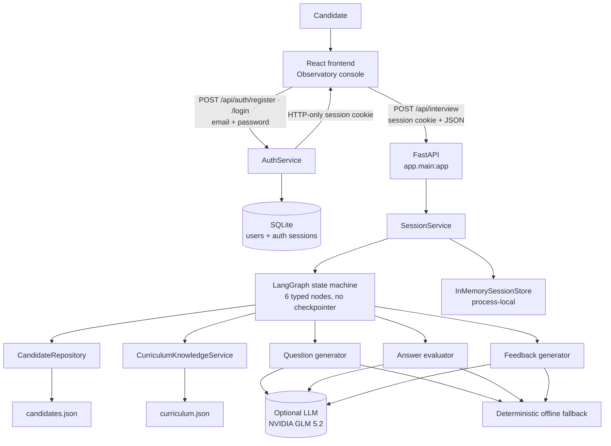
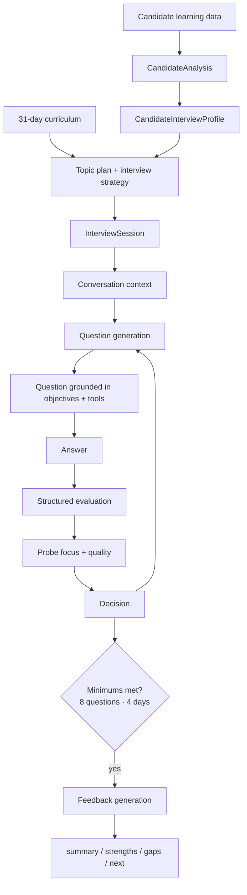
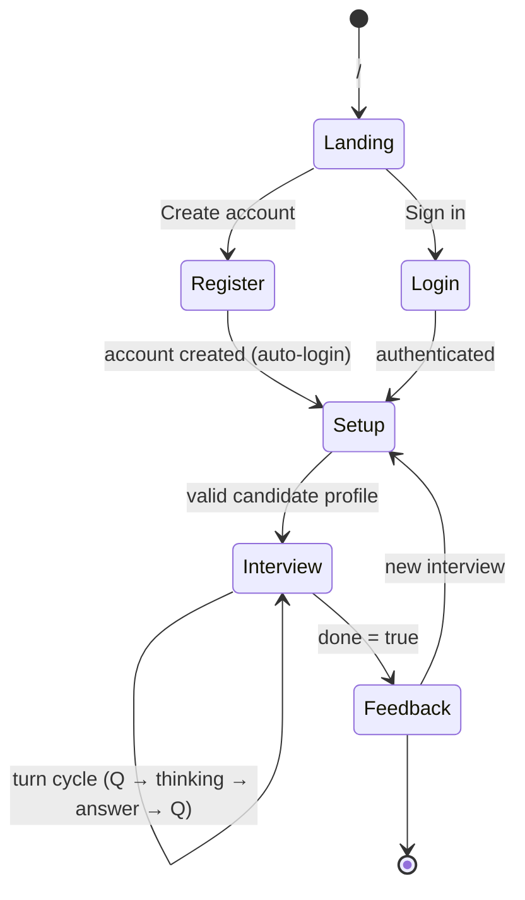

<div align="center">

# ProbeIQ

**An adaptive technical interview agent — questions, follow-ups, and feedback generated from the AI curriculum a candidate *actually* completed.**

A 31-day AI-cohort curriculum produces different learners. Generic questionnaires don't know that. ProbeIQ reads each candidate's learning data, plans an interview from the topics they really covered, adapts every next question to their last answer, and closes with a structured, evidence-based report.

[Architecture](#architecture) · [How it works](#how-it-works) · [Quick start](#quick-start) · [API](#api) · [Frontend](#frontend-experience) · [Contributing](#contributing)

</div>

---

## Overview

| | |
|---|---|
| **What** | A conversational AI technical interviewer for the 31-day AI Cohort curriculum |
| **Why** | Candidates finish *different* topics with *different* strengths — one fixed questionnaire cannot reflect that |
| **Who** | AI-cohort graduates, technical interviewers, hiring teams, hackathon judges |
| **How** | A deterministic, inspectable engine decides **what** to probe; an optional LLM decides **how** to phrase it and **how** to judge an answer |
| **Interface** | Text. An authenticated JSON API — `POST /api/auth/register \| /login \| /logout` plus `POST /api/interview` keyed by `sessionId`. Voice interaction is explicitly **out of scope** |

> **Two engines, one controller.** With no API key configured, ProbeIQ runs **fully offline** on deterministic question templates, heuristic answer evaluation, and rule-based feedback. When `PROBEIQ_LLM_ENABLED=true` with a key, an LLM (NVIDIA GLM 5.2 by default) elevates the phrasing and judgment — while the deterministic controller keeps deciding **what to ask next**. This separation is the core design of the project.

---

## Contents

- [The problem](#the-problem)
- [What ProbeIQ does](#what-probeiq-does)
- [Feature matrix](#feature-matrix)
- [How it works](#how-it-works)
  - [Interview workflow](#interview-workflow)
  - [Personalization](#personalization)
  - [Adaptive interview intelligence](#adaptive-interview-intelligence)
  - [Curriculum](#curriculum)
- [Architecture](#architecture)
- [Data flow](#data-flow)
- [AI / LLM](#ai--llm)
- [Frontend experience](#frontend-experience)
- [Design & motion system](#design--motion-system)
- [API reference](#api)
- [Error handling](#error-handling)
- [Technology stack](#technology-stack)
- [AI-assisted development workflow](#ai-assisted-development-workflow)
- [Testing & quality](#testing--quality)
- [Security](#security)
- [Docker](#docker)
- [Quick start](#quick-start)
- [Environment configuration](#environment-configuration)
- [Project structure](#project-structure)
- [Engineering decisions](#engineering-decisions)
- [Limitations](#limitations)
- [Roadmap](#roadmap)
- [Contributing](#contributing)
- [License](#license)

---

## The problem

An AI cohort runs for 31 days across 8 modules — environment tooling, data foundations, embeddings and vector search, LLM core and prompting, chatbot builds, agentic AI and MCP, evaluation and deployment, production and capstone.

No two candidates finish it identically:

```text
Candidate A  → passed RAG first try, strong on embeddings, skipped MCP
Candidate B  → passed MCP, struggled repeatedly with vector databases
Candidate C  → completed the whole cohort but failed Multi-Agent Orchestration
```

A traditional interview hands everyone the same question list and the same rubric. The **fastest learner is never stretched**, the **shakiest topic is never probed**, and the **interviewer has to guess** what each candidate knows.

ProbeIQ replaces "fixed questions + fixed evaluation" with a closed loop that is driven by the candidate's actual learning evidence.



---

## What ProbeIQ does

1. The candidate enters their **curriculum profile** (member details, completed missions, attempt counts, skipped days).
2. The system derives a **candidate interview profile** — strong topics, uncertain topics, failed days, topics to avoid assuming mastery on.
3. The engine **plans the interview**: which curriculum days to probe, at what depth, with what question budget.
4. The **first question** is generated from the candidate's evidence.
5. The candidate answers; the system **evaluates** the answer against the curriculum's objectives and tools.
6. The engine **decides** the next step: a deeper follow-up, a new topic, a difficulty change, or completion.
7. Conversation context is maintained as a compact structured state — **never a raw transcript dump**.
8. The interview completes only after **minimum coverage requirements** are met.
9. **Structured feedback** — summary, strengths, gaps, next steps — is generated from the actual transcript of evaluations.

Every step above is implemented and verified. A step-by-step trace of the same interview is **deterministic and replayable**: the engine never rolls dice.

---

## Feature matrix

Legend — ✅ Implemented · 🟡 Partial · 🔵 Planned / out of scope

| Capability | Status | Description | Implementation |
|---|---|---|---|
| Personalized interviews | ✅ | Every interview is planned from the candidate's learning data | `app/services/candidate_service.py`, `profile_service.py`, `topic_planner.py` |
| Curriculum-aware questioning | ✅ | Questions grounded in a specific day's objectives and tools | `app/orchestration/nodes/generate_question.py` |
| Candidate-aware questioning | ✅ | Role, experience, and topic evidence shape questions | `QuestionContext`, prompts in `app/prompts/` |
| Multi-turn conversation | ✅ | Sessions persist across requests via `sessionId` and are bound to the owning account | `InMemorySessionStore`, `app/services/session_service.py` |
| Adaptive follow-ups | ✅ | Follow-up targets the probe focus the evaluation recommends | `recommended_probe()` in `app/orchestration/decision.py` |
| Minimum question enforcement | ✅ | Completes only at ≥ 8 questions **and** ≥ 4 covered days | `min_questions`, `min_covered_days` in `app/core/config.py` |
| Hard safety cap | ✅ | Forced completion at 16 questions | `hard_max_questions` |
| Curriculum coverage tracking | ✅ | Covered days/topics recorded per turn | `InterviewSession.covered_curriculum_days` |
| Conversation context | ✅ | Compact structured context, not the raw transcript | `ConversationContext`, `QuestionContext` schemas |
| Structured LLM output | ✅ | Output validated by Pydantic + grounded against the curriculum | `app/agents/*`, `invoke_json()` |
| Failure safety / retry | ✅ | Failed turns mutate nothing; safe to retry | Store written only after a successful graph run |
| Feedback generation | ✅ | `summary / strengths / gaps / next` from real evaluations | `app/agents/feedback_agent.py` |
| HTTP API | ✅ | `POST /api/interview` per spec, plus the auth endpoints | `backend/app/api/routes/interview.py`, `backend/app/api/routes/auth.py` |
| Authentication | ✅ | Email/password accounts; Argon2id hashing; opaque session tokens | `app/api/routes/auth.py`, `app/core/security.py`, `app/services/auth_service.py` |
| Session-based access | ✅ | HTTP-only `probeiq_session` cookie; every interview session is bound to the account that started it (403 on cross-user access) | `get_current_user` in `app/api/dependencies.py` |
| Account persistence | ✅ | Users + auth sessions persist in SQLite (SQLAlchemy) and survive restarts | `app/models/`, `app/core/database.py` |
| Frontend interview app | ✅ | Login/register → landing → setup → interview → feedback | `frontend/src/` (React/Vite) |
| LLM-backed phrasing & judgment | 🟡 | Implemented, **off by default**; live inference unverified from the author machine (see [AI / LLM](#ai--llm)) | `app/llm/factory.py` |
| Interview-session persistence across restarts | 🔵 | Auth state persists in SQLite; interview sessions are in-memory and process-local by design | — |
| Voice interaction | 🔵 | Explicitly out of scope per the challenge specification | — |
| Observability / tracing | 🔵 | Planned; no app-level logging today (see [Limitations](#limitations)) | — |

---

## How it works

### Interview workflow

One HTTP request maps to **one LangGraph invocation**. The graph is compiled *without a checkpointer* — state is explicit, typed, and passed in/out per turn, which makes every turn retry-safe.



- **Start turn:** `analyze_candidate → plan_interview → generate_question`. The first question is always a fresh topic.
- **Answer turn:** `evaluate_response → decide_next_step`, then either `generate_feedback` (completion) or `generate_question` (continuation).
- **Commit safety:** the session is written to the store *only after a successful run*. A failed invocation changes nothing, so the client can simply retry with the same committed session.

The engine lives in `backend/app/orchestration/` (`graph.py`, `decision.py`, `nodes/`).

### Personalization

Every candidate is reduced to a deterministic, inspectable set of signals:

```text
member    → id, name, jobRole, yearsExperience, education, status
missions  → day, title, passed | skipped, attempts
signals   → commitDays, missionsCompleted, missionsFirstTry
```

Each mission is assessed into **evidence** (`backend/app/services/candidate_service.py`):

| Learning signal | Interpretation |
|---|---|
| `skipped` | Not assessed — no assumption of mastery |
| `passed: false` | Demonstrated difficulty — a diagnostic probe target |
| `passed`, 1 attempt | Strong positive signal — supports higher-depth questioning |
| `passed`, ≤ 3 attempts | Moderate — standard questioning depth |
| `passed`, > 3 attempts | Completed but "worth probing" — diagnostic depth |

That evidence becomes a `CandidateInterviewProfile` (`backend/app/services/profile_service.py`) with:

- `completed_days`, `failed_days`, `skipped_days`, `high_attempt_days`
- `strong_evidence_topics`, `uncertain_topics`, `recommended_topics`
- role context (technical vs. non-technical) used to tune scenario questions

The `TopicPlannerService` then allocates question slots across the selected days and assigns each topic a depth — **standard**, **high**, or **diagnostic** — and the `StrategyService` builds `primary_areas`, `probe_areas`, and `avoid_assuming` topics.

> **Why this matters:** Candidate A (strong on RAG, skipped MCP) and Candidate B (struggled with vector databases) never get the same interview. The plan, the depth, the wording, and the final feedback all diverge — deterministically.

### Adaptive interview intelligence

This is the heart of ProbeIQ. An interview is not a questionnaire — it is a **decision loop**:



Every answer is evaluated into a structured `Evaluation` (`score`, `assessment`, `strengths`, `missing_concepts`, `misconceptions`, `depth_level`, `recommended_probe`), then mapped to a coarse quality:

```text
misconceptions or score < 55                       → weak
score ≥ 80 and depth_level in (deep, excellent)    → strong
otherwise                                          → adequate
```

The deterministic controller (`backend/app/orchestration/decision.py`) turns that into a concrete next step:

| Condition | Decision |
|---|---|
| `question_count ≥ 8` **and** `covered_days ≥ 4` and answer not weak | **COMPLETE** |
| `question_count ≥ 16` (safety valve) | **COMPLETE** |
| ≥ 3 questions on the current topic | **NEW_TOPIC** |
| weak answer | **DECREASE_DIFFICULTY** (or **FOLLOW_UP** at the foundational floor) |
| adequate answer | **FOLLOW_UP** (same topic) |
| strong answer, topic not yet deepened | **INCREASE_DIFFICULTY** |
| strong answer, topic already deepened (2 strong answers) | **NEW_TOPIC** |

Difficulty moves along `foundational → intermediate → advanced`. Decisions are applied to a **deep copy** of the session; committed state is never mutated in place.

### Curriculum

The bundled curriculum (`backend/app/data/curriculum.json`) describes the cohort:

```text
AI Cohort · 31 days · 8 modules
 1. Environment & Tooling              (days 1–3)
 2. Data Foundations                   (days 4–6)
 3. Embeddings & Vector Search         (days 7–10)
 4. LLM Core, Prompting & Fine-Tuning  (days 11–15)
 5. Chatbot Application Build          (days 16–20)
 6. Agentic AI & MCP                   (days 21–24)
 7. Evaluation, Security & Deployment  (days 25–28)
 8. Production & Capstone              (days 29–31)
```

Each day carries `title`, `type`, `tools`, and `objectives` — the grounding surface for every question. The `CurriculumKnowledgeService` exposes it as a structured module → day → topic → objectives → tools graph that the question generator queries on every turn.

A sample roster of 20 candidates with distinct learning profiles ships in `backend/app/data/candidates.json`.

---

## Architecture



Verified layer-by-layer:

| Layer | Location | Role |
|---|---|---|
| API | `backend/app/api/routes/interview.py` | The interview endpoint, request/response shaping |
| Auth API | `backend/app/api/routes/auth.py` | Register / login / logout / me + session cookie handling |
| Auth core | `backend/app/core/security.py`, `core/database.py` | Argon2id hashing, token generation, SQLAlchemy engine/session wiring |
| Auth service | `backend/app/services/auth_service.py` | Registration, verification, session lifecycle |
| Auth persistence | `backend/app/models/`, `backend/app/repositories/` | `User` / `AuthSession` ORM models + repositories (SQLite) |
| Composition root | `backend/app/api/dependencies.py` | Service + LLM wiring + `get_current_user` gate |
| Services | `backend/app/services/` | Deterministic analysis, planning, strategy |
| Orchestration | `backend/app/orchestration/` | LangGraph nodes + decision rules |
| Agents | `backend/app/agents/` | Question / evaluation / feedback generators |
| Prompts | `backend/app/prompts/` | LLM prompt builders |
| LLM factory | `backend/app/llm/factory.py` | `ChatNVIDIA` / `ChatOpenAI` construction |
| Schemas | `backend/app/schemas/` | Pydantic models for every boundary |
| Repositories | `backend/app/repositories/` | JSON data access + in-memory sessions |
| Frontend | `frontend/src/` | React app (see below) |

---

## Data flow



| Stage | What happens |
|---|---|
| **Candidate profile** | Raw missions become strong/uncertain/probe signals |
| **Curriculum** | Selected days, per-topic depth and question slots |
| **Interview context** | Compact structured state: covered topics, questions asked, last answers, difficulty |
| **Question generation** | Grounded in day objectives + tools + role + evidence |
| **Evaluation** | Score, depth, misconceptions, missing concepts, probe focus |
| **Decision** | Follow-up, new topic, difficulty change, or complete |
| **Feedback** | Real transcript-derived summary, strengths, gaps, next steps |

---

## AI / LLM

ProbeIQ is **not** "an LLM with a prompt." It is a deterministic orchestrator that uses an LLM at exactly two points — phrasing and judgment — and only when enabled.

| Aspect | Value (verified in `backend/app/`) |
|---|---|
| Provider (default) | NVIDIA-hosted GLM 5.2 — model id `z-ai/glm-5.2` via `ChatNVIDIA` |
| Base URL | `https://integrate.api.nvidia.com/v1` (applied automatically) |
| Client library | `langchain-nvidia-ai-endpoints` (`ChatNVIDIA`), `langchain-openai` (`ChatOpenAI`) |
| Other providers | `openai` and `openai-compatible` (base URL required) |
| Structured output | Every agent returns JSON, validated with Pydantic, cross-checked against the curriculum |
| Key handling | `SecretStr` — never logged, never in errors, never in source |
| Sampling (defaults) | `temperature 0`, `top_p 1.0`, `max_tokens 16384`, `seed 42` |
| Retries | Bounded: `max_retries 2` is passed to `ChatOpenAI`; `ChatNVIDIA` handles retries internally |

**What the LLM may and may not do:**

- ✅ Phrase a question the controller already decided to ask (`LLMQuestionGenerator`)
- ✅ Judge an answer and return a structured `Evaluation` (`LLMAnswerEvaluator`)
- ✅ Write the final feedback from interview evidence (`LLMFeedbackGenerator`)
- ❌ Decide what to probe next — that is `app/orchestration/decision.py`, always deterministic
- ❌ Inject ungrounded content — output is validated and cross-checked (a question must match the current day/topic/difficulty; feedback must not reference an uncovered topic)

**LLM output validation** (`app/agents/llm_utils.py`): a single non-streaming `invoke` call, JSON extracted and parsed; any failure raises `InterviewEngineError("LLM call failed; no state was changed.")` so callers retry safely.

> **Honest note on live verification.** The offline/deterministic path is fully verified and is the default. Live NVIDIA inference could **not** be verified from the authoring machine: valid `POST /chat/completions` requests to the gateway return zero bytes and time out (up to ~90 s) via `httpx`, `curl`, and raw sockets alike, while the gateway answers validation errors instantly. This is an HTTP/API-level environment issue, not an application defect — and the application's failure path is designed to handle it gracefully (safe 500, no state change). Live LLM verification is deferred to a machine with working connectivity to the gateway.

---

## Frontend experience

The frontend is a real, runnable React application ("**The Observatory 3D**", spec in `frontend/DESIGN.md`) integrated only against the verified backend contract.



| Route | Screen |
|---|---|
| `/` | **Landing** — what the interviewer is, CTAs to sign in or create an account |
| `/login` | **Login** — email + password; errors inline |
| `/register` | **Register** — create an account (auto-login), password ≥ 8 chars |
| `/setup` | **Candidate setup** — paste the candidate JSON profile (sample pre-filled), validated client-side |
| `/interview` | **Interview** — question card, transcript, answer composer, curriculum progress, timer, thinking state |
| `/complete` | **Feedback** — the post-interview debrief |

All protected routes sit behind `RequireAuth` (`frontend/src/components/auth/RequireAuth.tsx`): an unauthenticated visitor is redirected to `/login`, and after logout the auth state resets. Route guards are UX only — the backend enforces authentication on every interview request.

Key behaviors verified by the 51-test Playwright suite:

- Question cards announce via `aria-live`; the thinking state is exposed as a `role="status"` region and disables the composer.
- Failed answer submissions **roll back the transcript** and keep the text in the composer for a one-click retry.
- Curriculum coverage is visualized as per-day glyphs (covered / skipped / open).
- The WebGL presence degrades gracefully: no-WebGL and low-power devices get a static poster; `prefers-reduced-motion` flattens all motion.
- No horizontal overflow from 375 px to 1440 px.

State lives in two zustand stores: `src/stores/authStore.ts` (account, session bootstrapping via `GET /api/auth/me`, login/register/logout) and `src/stores/interviewStore.ts` (driving `idle → thinking → active → complete`); pages stay thin and delegate to hooks/services. The backend is reached through one axios client (`src/api/client.ts`) configured with `withCredentials: true` so the session cookie is sent, against `POST /api/interview` and the auth endpoints, with a Vite dev proxy (`/api` → `http://localhost:8000`, configurable via `PROBEIQ_API_TARGET`).

### Design & motion system

The design language is **restrained observatory, not neon cyberpunk** — a deep-space dark base, a desaturated-teal accent, and a single WebGL "presence" as the AI interviewer, loaded lazily and never the LCP element.

Motion communicates state rather than decorating:

| Presence state | Trigger | Motion |
|---|---|---|
| `IDLE` | app open | slow drift, soft breathing |
| `THINKING` | request in flight | core contracts + brightens, short damped spin-up |
| `RESPONDING` | reply arrives | brief burst, ease to neutral |
| `WAITING` | awaiting input | near-still (ambient movement gated ~0.3×) |
| `COMPLETE` | `done: true` | quiets and recedes; render loop pauses |

On "Begin interview" the 3D core **recedes** (scale/opacity/depth) so the 2D console becomes the focus. Questions push in from depth (`z: -80`, `rotateX: -3`) through two centralized springs (`src/lib/motion.ts`): `snappy` and `ui`. `prefers-reduced-motion` collapses every 3D move to a 2D fade. Typography: Outfit (UI) + JetBrains Mono (interviewer voice, labels, timestamps).

---

## API

The complete contract is defined in `.opencode/technical-spec.md`. The interview endpoint follows the spec; authentication is a deliberate extension (implemented per user request) that guards it with a session cookie.

### `POST /api/auth/register` · `POST /api/auth/login`

Register a new account (201) or verify credentials (200). Both accept `{ "email": "...", "password": "..." }` (password ≥ 8 chars on register, enforced via `422 invalid_request`) and respond with the user plus an **HTTP-only session cookie** (`probeiq_session`, `SameSite=Lax`, `Secure` in production, 14-day TTL):

```json
{ "id": "4b…uuid…", "email": "candidate@example.com" }
```

Errors: `401 invalid_credentials` (bad login — single generic message, never reveals whether the account exists), `409 account_already_exists` (duplicate register email).

### `POST /api/auth/logout`

Revokes the session server-side and clears the cookie. Returns `{ "detail": "logged out" }`.

### `GET /api/auth/me`

Resolves the current session. Always 200: `{ "user": {id, email} }` when authenticated, `{ "user": null }` when not. The frontend calls this on boot to seed the auth store.

### `POST /api/interview` (authenticated)

Requires a valid `probeiq_session` cookie — otherwise `401 not_authenticated`. A started session is bound to the authenticated user; driving a session started by a different account returns `403 forbidden`.

| Use | Request body |
|---|---|
| **Start a session** | `{ "sessionId": "...", "candidate": { ... } }` |
| **Send a turn** | `{ "sessionId": "...", "message": "..." }` |

Exactly one of `candidate` (start) or `message` (turn) must be present — otherwise `422`. All responses are `{ "reply": string, "done": bool, "feedback": null | {summary, strengths, gaps, next} }`.

**Start — real captured response (LLM disabled):**

```json
{
  "sessionId": "demo-2",
  "candidate": {
    "member": {
      "id": "CAND-001",
      "name": "Sarah Johnson",
      "jobRole": "Senior Data Engineer",
      "yearsExperience": 9,
      "education": "MS Computer Science",
      "status": "COMPLETED"
    },
    "missions": [
      { "day": 7, "title": "Embeddings Explained", "passed": true, "attempts": 1 },
      { "day": 8, "title": "Vector Databases Overview", "passed": true, "attempts": 1 },
      { "day": 10, "title": "Retrieval & Matching Engine", "passed": true, "attempts": 2 },
      { "day": 12, "title": "Prompt Engineering Fundamentals", "passed": true, "attempts": 4 },
      { "day": 16, "title": "Chatbot Backend & API Integration", "passed": true, "attempts": 1 },
      { "day": 22, "title": "Multi-Agent Orchestration", "passed": true, "attempts": 2 },
      { "day": 23, "title": "Model Context Protocol (MCP)", "passed": true, "attempts": 2 },
      { "day": 28, "title": "Docker & Kubernetes Deployment", "passed": true, "attempts": 3 },
      { "day": 29, "title": "Monitoring, Logging & Observability", "skipped": true },
      { "day": 31, "title": "Capstone Project & Final Demo", "passed": true, "attempts": 1 }
    ],
    "signals": { "commitDays": 28, "missionsCompleted": 30, "missionsFirstTry": 20 }
  }
}
```

```json
// 200 OK
{
  "reply": "[dev-template] Walk through how you would implement 'Understand how text is converted into vector embeddings' for Embeddings Explained.",
  "done": false,
  "feedback": null
}
```

The `[dev-template]` prefix marks the deterministic offline question generator (LLM phrasing would omit it).

**Answer turn — real captured response:**

```json
{
  "sessionId": "demo-2",
  "message": "Embeddings map tokens into a vector space where semantically similar items are closer together, so retrieval can match by meaning rather than exact keywords."
}
```

```json
// 200 OK
{
  "reply": "[dev-template] Your previous answer was conceptually sound. Now design it for architecture: components, trade-offs, and failure handling for 'Understand how text is converted into vector embeddings'.",
  "done": false,
  "feedback": null
}
```

Note how the follow-up is generated from the evaluation's probe focus — the adaptive loop in action.

**Completion — real captured response (8 turns):**

```json
{
  "reply": "Interview completed.",
  "done": true,
  "feedback": {
    "summary": "Interview complete: 8 questions across 4 curriculum days; 4/8 answers strong, 4 adequate, 0 weak.",
    "strengths": [
      "Demonstrated strong understanding of Multi-Agent Orchestration"
    ],
    "gaps": [
      "Incomplete understanding of Embeddings Explained: Generate embeddings for every knowledge base chunk",
      "Incomplete understanding of Model Context Protocol (MCP): Build an MCP server exposing healthcare chatbot tools",
      "Incomplete understanding of Vector Databases Overview: Learn the role of vector databases in RAG applications"
    ],
    "next": [
      "Review: Generate embeddings for every knowledge base chunk",
      "Review: Store embeddings alongside the original documents",
      "Review: Build an MCP server exposing healthcare chatbot tools"
    ]
  }
}
```

Feedback arrays are capped at 3 items each; every statement traces back to a recorded evaluation or curriculum plan — nothing is invented.

---

## Error handling

Errors are always `{ "error": code, "detail": message }`, produced by a typed exception hierarchy (`backend/app/core/exceptions.py`) and global handlers in `backend/app/main.py`. Stack traces and credentials never reach the client.

| Status | `error` | Trigger |
|---|---|---|
| 400 | `invalid_request` | Empty or whitespace-only `message` on a turn |
| 400 | `session_completed` | Sending a turn to a finished session |
| 401 | `not_authenticated` | Missing/invalid/expired session cookie on `POST /api/interview` |
| 401 | `invalid_credentials` | Wrong email or password on login (single generic message) |
| 403 | `forbidden` | Driving an interview session started by a different account |
| 404 | `session_not_found` | Unknown `sessionId` |
| 404 | `candidate_not_found` / `day_not_found` | Data reference not found |
| 409 | `session_already_exists` | Re-using a `sessionId` to start |
| 409 | `account_already_exists` | Registering with an email that already has an account |
| 422 | `invalid_request` | Schema validation failure — missing `sessionId`, wrong types, both/neither of `candidate`/`message`, a malformed candidate payload, or a register password shorter than 8 chars |
| 500 | `interview_engine_error` | LLM failure, malformed LLM output, empty topic plan |
| 500 | `data_load_error` | Candidate/curriculum JSON failed to load |
| 500 | `llm_configuration_error` | LLM enabled but misconfigured (missing key/model) |
| 500 | `internal_error` | Anything unhandled (generic, no internals leaked) |

**Failure safety:** the session store is written only after a complete, successful graph run. A failed evaluation or LLM call leaves the committed session byte-identical, so a turn can be retried without corrupting state (covered by a dedicated test).

---

## Technology stack

### Product runtime

**Frontend** (verified in `frontend/package.json`):

| Technology | Purpose |
|---|---|
| React 19 + TypeScript | UI and type safety |
| Vite 8 | Dev server, build, `/api` proxy |
| Tailwind CSS v4 | Design tokens and styling |
| Framer Motion | Purposeful motion + spring system |
| three.js + @react-three/fiber | The lazy-loaded WebGL presence |
| zustand | Client state |
| axios | HTTP client |
| react-router-dom | Routing |
| zod | Client-side profile validation |
| Outfit / JetBrains Mono | Typography (variable fonts) |

**Backend** (verified in `backend/pyproject.toml`):

| Technology | Purpose |
|---|---|
| Python 3.13 | Runtime |
| FastAPI + uvicorn | HTTP API |
| Pydantic v2 + pydantic-settings | Validation + `PROBEIQ_` env config |
| SQLAlchemy 2.x + SQLite | Auth persistence (users + sessions) |
| argon2-cffi | Argon2id password hashing |
| email-validator | `EmailStr` validation on auth schemas |
| LangGraph | Typed interview state machine |
| LangChain | Chat-model integration (`ChatNVIDIA`, `ChatOpenAI`) |
| httpx | HTTP client stack |
| JSON data files | Curriculum + candidate roster |

**Data:** auth accounts and sessions persist in **SQLite** via SQLAlchemy (default file `app/data/probeiq.db`, overridable via `PROBEIQ_DATABASE_URL`). Interview sessions remain in `InMemorySessionStore` (process-local, mutex-protected). `asyncpg` and `redis` are declared in `pyproject.toml` but are **unused placeholders** — do not treat them as part of the running system.

### Development tooling

| Tool | Purpose |
|---|---|
| uv | Locked dependency management (pinned 0.11.21) |
| pytest | Backend unit/integration suite |
| ruff | Linting |
| mypy | Type checking |
| Playwright | Frontend end-to-end tests |
| ESLint + TypeScript | Frontend quality |
| Docker / Compose | Containerized backend |

### Design / AI-coding skills

These assist *development* of ProbeIQ; they are **not** runtime dependencies. See [AI-assisted development workflow](#ai-assisted-development-workflow).

---

## AI-assisted development workflow

ProbeIQ is built with an AI-coding workflow whose guardrails are part of the repository. Three distinct categories, deliberately separated:

| Category | Tool | Contribution |
|---|---|---|
| **Coding agent** | OpenCode | Implements backend, frontend, tests; reads the project rules before touching anything |
| **Design / UX skills** | `ui-ux-pro-max` | UI/UX design intelligence with a searchable database (typography, color, layout, motion) |
| **Design / UX skills** | `impeccable` | UX critique, audit, polish, and motion guidance |
| **Design / UX skills** | `design-taste-frontend`, `high-end-visual-design`, etc. | Visual-quality direction (available in `.agents/skills/`) |
| **Project instruction files** | `.opencode/PROJECT.md`, `AGENT.md`, `BACKEND.md`, `FRONTEND.md`, `RULES.md`, `GIT.md`, `technical-spec.md` | Project-specific constraints: API contract, no hallucination, no invented features, safe Git rules |
| **Design spec** | `frontend/DESIGN.md` | The locked "Observatory 3D" design decisions |

The workflow the agents follow: **inspect → plan → implement → test → review → show the diff → commit only when asked**. The frontend's design system was derived through the `ui-ux-pro-max` and `impeccable` skills, then locked in `DESIGN.md`; the backend's anti-hallucination rules (`AGENT.md`, `RULES.md`) are what keep every claim in this README verifiable.

---

## Testing & quality

All results below were **run and verified at the time of this README revision** (Aug 2026) — they may drift as the codebase evolves.

| Check | Command (from `backend/` unless noted) | Result |
|---|---|---|
| Backend tests | `uv run pytest` | **180 passed, 3 skipped** (~5.5 s). The 3 skips are opt-in live-LLM tests (`PROBEIQ_LIVE_LLM_TEST=true`) that keep the default suite fully offline and deterministic. |
| Lint | `uv run ruff check app tests` | Clean |
| Types | `uv run mypy app tests` | Clean — 89 source files |
| Frontend build | `npm run build` (from `frontend/`) | Clean |
| Frontend lint | `npm run lint` (from `frontend/`) | Clean |
| Frontend e2e | `npm run test:e2e` (from `frontend/`) | **51 passed, 4 skipped** — full interview loop, completion + report, error rollback/retry, accessibility, reduced motion, responsive overflow, WebGL fallbacks, plus account register/login/logout and protected-route guards |

**What the backend suite covers** (20 test files under `backend/tests/`): candidate/curriculum schemas and repositories, deterministic analysis and profile services, topic planning and strategy, question generation, the evaluation and feedback engines, the LangGraph adaptive engine (decision sequences, minimums, hard cap), session store concurrency, the LLM factory, auth (register/login/logout/me, duplicate account, wrong password, ownership enforcement), and the API contract (start/turn/completion, all error codes).

`backend/audit_verify.py` is a deterministic audit driver runnable independently of pytest; the Phase 15 report in `backend/AUDIT_REPORT.md` records **30 PASS / 2 WARN / 0 FAIL** across its deterministic checks.

---

## Security

- **Secrets:** the API key is a `SecretStr`; it is never logged, never printed, and never included in error messages. `backend/.env` is git-ignored; `.env.example` ships placeholders only.
- **Docker:** `.dockerignore` excludes `.env` and caches, so the key never enters the image. `docker-compose.yml` loads `backend/.env` as an *optional* `env_file`.
- **Validation:** every request is validated by Pydantic; global exception handlers sanitize 500 responses (no stack traces).
- **CORS:** explicit, environment-configured origins (`PROBEIQ_CORS_ALLOWED_ORIGINS`), no wildcard. Credentials are enabled because the API authenticates via an HTTP-only session cookie, so origins must stay explicit; an empty value disables the middleware.
- **Passwords:** Argon2id via `argon2-cffi` (`app/core/security.py`); login failures return one generic message so callers cannot distinguish "unknown email" from "wrong password".
- **Sessions:** opaque, cryptographically random tokens (`secrets.token_urlsafe(48)`) stored server-side in SQLite until logout or expiry, delivered as an HTTP-only `SameSite=Lax` cookie (`Secure` in production). Logout revokes the row immediately.
- **Ownership:** every interview session is bound to the authenticated user; cross-account access to a session is rejected server-side (`403 forbidden`). Frontend route guards are UX only.
- **Known limitation:** `DataLoadError` currently surfaces absolute filesystem paths in its 500 `detail` (open audit finding P1-2); treat data-load errors as diagnostic information, not as a feature.

> ⚠️ **Never commit `backend/.env`.** It may hold a live NVIDIA/OpenAI API key. If a key is ever printed to a terminal or a PR, rotate it immediately.

---

## Docker

The backend is fully containerized; the frontend runs via Vite/Node (a frontend container image is **not** currently shipped).

- `backend/Dockerfile` — `python:3.13-slim`, `uv 0.11.21`, production deps only (dev group excluded), runs `uvicorn app.main:app --host 0.0.0.0 --port 8000`.
- `backend/.dockerignore` — keeps `.env`, `.venv`, caches, and tests out of the image.
- `docker-compose.yml` (repo root) — a single `backend` service on port `8000`, optional `env_file: ./backend/.env`. No PostgreSQL service: auth persistence is SQLite, which needs no extra container. The SQLite file lives in the container's filesystem (default `app/data/probeiq.db`), so a *rebuilt* container starts with an empty auth database unless you mount a volume or point `PROBEIQ_DATABASE_URL` at persistent storage.

```bash
docker build -t probeiq-backend ./backend
docker compose up -d        # from the repo root
docker compose down         # never `down -v`
```

---

## Quick start

### Prerequisites

- **Backend:** Python 3.13 + [uv](https://docs.astral.sh/uv/) (`backend/.python-version` = 3.13)
- **Frontend:** Node.js (npm) — Vite 8
- **Optional:** Docker / Compose; an NVIDIA (or OpenAI-compatible) API key for LLM-backed interviews

### Backend

```bash
cd backend
uv sync --locked            # install the locked environment
uv run uvicorn app.main:app --reload
```

The API is now at `http://localhost:8000` (`/docs` for the interactive Swagger UI, `/openapi.json` for the schema). It runs **fully offline by default**.

### Frontend

```bash
cd frontend
npm install
npm run dev                 # http://localhost:5173, /api proxied to :8000
```

The Vite proxy target is configurable: `PROBEIQ_API_TARGET=http://localhost:8000 npm run dev`.

Open `http://localhost:5173`, **create an account** (or log in), then run an interview. All protected screens redirect to `/login` until you're authenticated. If you hit the API directly, you must first `POST /api/auth/register` (or `/login`) and keep the resulting `probeiq_session` cookie for `POST /api/interview` (e.g. `curl -c cookies.txt -b cookies.txt`).

### Verify

```bash
# backend/ — tests, lint, types
uv run pytest
uv run ruff check app tests
uv run mypy app tests

# frontend/ — build, lint, e2e (e2e starts its own backend on :8001 + Vite on :5174)
npm run build
npm run lint
npm run test:e2e
```

---

## Environment configuration

All backend settings come from environment variables with the `PROBEIQ_` prefix, loaded via pydantic-settings. Copy `backend/.env.example` → `backend/.env` for local overrides (git-ignored). Never commit a real key.

| Variable | Default | Purpose |
|---|---|---|
| `PROBEIQ_DATA_DIR` | `app/data` | Directory with `curriculum.json` / `candidates.json` |
| `PROBEIQ_ENVIRONMENT` | `development` | Runtime environment label (`production` also sets the session cookie `Secure` flag) |
| `PROBEIQ_CORS_ALLOWED_ORIGINS` | `http://localhost:5173,http://127.0.0.1:5173` | Allowed browser origins (no wildcard; credentials enabled) |
| `PROBEIQ_DATABASE_URL` | *(empty)* | SQLAlchemy URL for auth persistence; default `sqlite:///app/data/probeiq.db` (relative to `backend/`). Never commit real credentials in it |
| `PROBEIQ_AUTH_COOKIE_NAME` | `probeiq_session` | HTTP-only session cookie name |
| `PROBEIQ_AUTH_SESSION_TTL_DAYS` | `14` | Session token lifetime |
| `PROBEIQ_MIN_QUESTIONS` | `8` | Minimum questions before completion |
| `PROBEIQ_MIN_COVERED_DAYS` | `4` | Minimum distinct curriculum days covered |
| `PROBEIQ_MAX_QUESTIONS_PER_TOPIC` | `3` | Topic saturation cap |
| `PROBEIQ_HARD_MAX_QUESTIONS` | `16` | Hard completion safety valve |
| `PROBEIQ_LLM_ENABLED` | `false` | Enable LLM-backed phrasing/judgment |
| `PROBEIQ_LLM_PROVIDER` | `openai-compatible`¹ | `nvidia` \| `openai` \| `openai-compatible` |
| `PROBEIQ_LLM_MODEL` | *(unset)*¹ | Chat model id |
| `PROBEIQ_LLM_BASE_URL` | *(empty)* | NVIDIA default applied when empty |
| `PROBEIQ_LLM_API_KEY` | *(empty)* | **Your key — never commit** |
| `PROBEIQ_LLM_TEMPERATURE` | `0` | Sampling temperature |
| `PROBEIQ_LLM_TOP_P` | `1.0` | Sampling top-p |
| `PROBEIQ_LLM_MAX_TOKENS` | `16384` | Max completion tokens |
| `PROBEIQ_LLM_SEED` | `42` | Sampling seed |
| `PROBEIQ_LLM_MAX_RETRIES` | `2` | Bounded retry count |

**Frontend** (all optional): `PROBEIQ_API_TARGET` (dev proxy target, default `http://localhost:8000`), `PROBEIQ_E2E_API_PORT`, `PLAYWRIGHT_BASE_URL`, `PLAYWRIGHT_PREVIEW`.

> ¹ Code defaults. The shipped `backend/.env.example` overrides both to the NVIDIA path (`nvidia` / `z-ai/glm-5.2`) — that is the documented way to enable LLM-backed interviews.

---

## Project structure

```text
ProbeIQ/
├── backend/                       # FastAPI + LangGraph interview engine
│   ├── app/
│   │   ├── api/                   #   routes (auth + POST /api/interview) + wiring
│   │   ├── agents/                #   question / evaluation / feedback generators
│   │   ├── core/                  #   config (PROBEIQ_), exceptions, security, database, app factory
│   │   ├── data/                  #   curriculum.json, candidates.json, probeiq.db (auth)
│   │   ├── llm/                   #   chat-model factory (ChatNVIDIA / ChatOpenAI)
│   │   ├── models/                #   SQLAlchemy models (User, AuthSession)
│   │   ├── orchestration/         #   LangGraph graph, nodes, decision rules
│   │   ├── prompts/               #   LLM prompt builders
│   │   ├── repositories/          #   JSON data access + in-memory session store + auth repos
│   │   ├── schemas/               #   Pydantic models (candidate, session, evaluation, auth…)
│   │   └── services/              #   deterministic analysis / planning / strategy / auth
│   ├── tests/                     #   20 files · 180 passed · 3 skipped
│   ├── pyproject.toml             #   deps + dev group + pytest config
│   ├── uv.lock                    #   locked environment
│   ├── .env.example               #   documented env vars (placeholders only)
│   ├── Dockerfile / .dockerignore
│   ├── AUDIT_REPORT.md            #   Phase 15 backend audit (+ auth addendum)
│   └── audit_verify.py            #   deterministic audit driver (30 checks)
├── frontend/                      # React 19 + Vite 8 + TS + Tailwind v4
│   ├── src/
│   │   ├── pages/                 #   Landing · Login · Register · CandidateSetup · Interview · Feedback
│   │   ├── components/            #   interview/, feedback/, candidate/, three/, ui/, auth/
│   │   ├── hooks/ services/ stores/ api/ types/ constants/
│   │   ├── router/ lib/ utils/ layouts/
│   │   └── index.css              #   design tokens
│   ├── e2e/                       #   Playwright suite (51 passed · 4 skipped)
│   ├── public/                    #   favicon, icons
│   ├── DESIGN.md                  #   locked "Observatory 3D" design spec
│   ├── index.html / vite.config.ts / playwright.config.ts / tsconfigs / eslint.config.js
│   └── package.json
├── .opencode/                     # AI-agent instructions + API contract
│   ├── technical-spec.md          #   the submission contract (source of truth for the API)
│   ├── PROJECT.md AGENT.md BACKEND.md FRONTEND.md RULES.md GIT.md
│   ├── candidates.json curriculum.json   #   sample data (mirrors backend data)
│   └── skills/ui-ux-pro-max/      #   vendored UI/UX skill
├── docker-compose.yml             # single backend service, port 8000
├── explanation.md                 # backend state deep-dive
└── AGENTS.md                      # repository guide for AI agents
```

---

## Engineering decisions

Where a decision is an architectural rationale inferred from the implementation rather than a documented historical fact, it is labelled as such.

| Decision | Why | Trade-off |
|---|---|---|
| **FastAPI + Pydantic v2** | Typed request/response contracts, validation at the boundary, OpenAPI for free, easy to test | Synchronous engine turns; sync SQLAlchemy/SQLite exercised (auth), async/redis stack still unused |
| **uv** | Fast, locked, reproducible installs (`uv.lock`); single tool for deps + venv | Ecosystem is newer than pipenv/poetry |
| **Deterministic engine in front of an optional LLM** | The interview's *decisions* are inspectable, testable, and replayable; the LLM only adds phrasing/judgment. Anti-hallucination by construction. | LLM quality ceiling is limited to what the controller asks |
| **LangGraph state machine** | Explicit typed state, one HTTP request per invocation, no hidden globals, retry-safe | No checkpointer — state must be re-fed each turn |
| **In-memory interview session store** | Correct for a hackathon/single-process deployment; zero infra; auth state separately persisted in SQLite | Interview sessions do not survive restarts and are not horizontally scalable |
| **SQLite + SQLAlchemy for auth** | Accounts and sessions need durable, restart-safe storage with zero operational overhead; SQLAlchemy keeps a path open to Postgres later | SQLite is single-writer; a separate Postgres would be needed at scale |
| **Cookie-session authentication** | HTTP-only cookie keeps the token out of JS; server-side sessions (opaque tokens) can be revoked immediately on logout | No cross-device bearer tokens; requires explicit CORS origins with credentials |
| **JSON curriculum + candidate data** | Data is versionable, readable, and trivially swappable | Not a queryable database; candidates must be passed in the request |
| **LLM output validated + cross-checked** | A malformed or ungrounded LLM response can never corrupt a session or fabricate content | Slightly more code; occasional retries on invalid output |
| **Single interview endpoint + auth extension** | `POST /api/interview` is mandated by `technical-spec.md`; authentication was added as a deliberate, user-approved extension guarding it | The base spec's unauthenticated contract is intentionally no longer exposed |
| **React 19 + Vite + TS + Tailwind v4** | Fast tooling, typed frontend, token-driven styling | Heavier toolchain than a minimal scaffold |
| **WebGL presence, lazy-loaded, reduced-motion-aware** | A calm "interviewer presence" without hurting first paint or accessibility | Extra ~880 kB WebGL chunk (ships in a lazy route) |
| **Centralized spring system (`src/lib/motion.ts`)** | Consistent motion values, easy global tuning | One more indirection layer |

---

## Limitations

Honest boundaries of the current implementation:

- **Interview sessions are in-memory and process-local.** Auth state persists in SQLite, but a server restart drops all interview sessions and their transcripts. Not intended for multi-process or production traffic yet.
- **No rate limiting / lockout on auth endpoints.** Login/register are not throttled; brute-force protection (rate limiting, account lockout) is not implemented.
- **Session-token brute force is bounded only by token entropy** (48 random bytes); no per-IP throttling layer exists.
- **SQLite is single-writer.** `asyncpg` / `redis` remain unused placeholders; a Postgres migration is a follow-up.
- **LLM live path unverified from the authoring machine** (network-level gateway timeouts; see [AI / LLM](#ai--llm)). The offline path is the verified default.
- **No observability/tracing** in application code (open audit finding); the backend logs nothing today.
- **`DataLoadError` leaks absolute paths** in 500 responses (open audit finding P1-2).
- **Frontend container image not shipped** — only the backend is Dockerized.
- **Minor:** one pre-existing Starlette/httpx deprecation warning surfaces during pytest.
- **`backend/main.py` is a dead stub** — the real entrypoint is `backend/app/main.py` (`app.main:app`).

---

## Roadmap

**Current (implemented & verified)**

- Deterministic adaptive interview engine (plan → question → evaluate → decide → feedback)
- Offline template question generation + heuristic evaluation
- Optional NVIDIA GLM 5.2 (and OpenAI-compatible) LLM path with grounded structured output
- Account authentication: register/login/logout with Argon2id, HTTP-only session cookies, SQLite persistence, interview ownership
- React "Observatory 3D" frontend with login/register, feedback, retry, accessibility, and reduced-motion support
- Docker + Compose for the backend; CORS with credentials configured
- 180 backend tests, 51 e2e tests, ruff/mypy clean

**Planned (direction indicated by the codebase, not yet implemented)**

- Live NVIDIA inference verification on a network-valid machine (end-to-end)
- Observability: structured logging, per-node timing (open audit P2-4)
- Sanitize `DataLoadError` paths (open audit P1-2)
- Auth hardening: rate limiting / brute-force protection on login
- Persisted, restart-safe interview sessions (Postgres migration path exists via SQLAlchemy)
- Frontend topic-transition choreography — the extension point exists (`InterviewHeader` `topic` prop) and awaits reliable topic metadata from the backend

**Future (ideas consistent with project direction)**

- Deployment hardening, load testing, dependency vulnerability scanning (`pip-audit`)
- Demo media (captured after the final UI pass — none exist in the repo today)

---

## Contributing

This repository is built to be AI-assistable but the same rules apply to humans. The safety rules in `.opencode/GIT.md` are strict: no force-pushes, no history rewrites, targeted staging only.

1. **Fork** the repository and create a branch (`git checkout -b feat/your-change`).
2. **Change** the smallest relevant surface — read the surrounding code first.
3. **Verify** from `backend/`: `uv run pytest`, `uv run ruff check app tests`, `uv run mypy app tests`. Frontend: `npm run lint`, `npm run build`, and `npm run test:e2e` from `frontend/`.
4. **Never** stage secrets, `.env`, `node_modules/`, caches, or build artifacts. Prefer targeted `git add <path>`.
5. **Commit** with a clear message; **push** and open a pull request.

If you are contributing AI-generated changes, follow `.opencode/AGENT.md`: inspect before modifying, never claim something works until it is verified, and never invent functionality.

---

## License

No license file is present in this repository at this time.

---

<div align="center">

**ProbeIQ** — an adaptive technical interview agent for the AI Cohort curriculum.

Built with a deterministic interview engine in front of an optional LLM — because the *decisions* should be inspectable even when the *wording* is generative.

</div>
